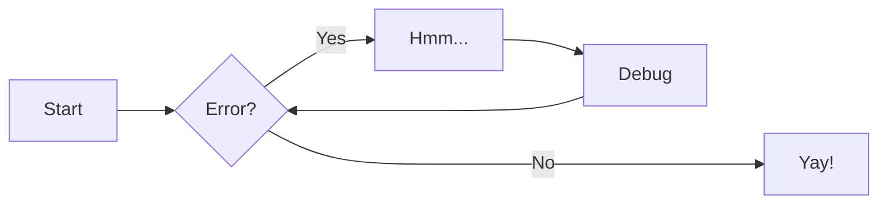

## h2
!!! note
    hi

### h3
??? abstract
    hi

???+ info
    hi

#### h4
!!! tip "TIP"

!!! success inline
    inline

asdfasdf

## h2_2
asdfasdf

!!! success inline end
    inline end

!!! question

!!! warning

### h3
!!! failure

!!! danger

#### h4
!!! bug

##### h5
!!! example

###### h6
!!! quote

++ctrl+alt+del++

```python title="test.py" linenums="1" hl_lines="2"
import random
import torch
import os
```



- [x] first
    * [x] second
- [ ] third

`def`
:   definition


| this | is | table |
| --- | --- | --- |
| element | element | element |


=== "option1"
    hi

=== "option2"
    hello

:fontawesome-regular-face-laugh-wink:

[Home Button](#){ .md-button .md-button--primary }

Lorem ipsum[^1].

[^1]: Lorem ipsum.

$$
\begin{matrix}
&\sum\limits_{i=0}^{\infty}{i}\\
&\beta
\end{matrix}
$$

$\alpha\alpha\alpha\alpha\alpha\alpha\alpha\alpha\alpha\alpha\alpha\alpha\alpha\alpha\alpha\alpha\alpha\alpha\alpha + \alpha\alpha\alpha\alpha\alpha\alpha\alpha\alpha\alpha\alpha\alpha\alpha\alpha\alpha\alpha\alpha\alpha+
\alpha\alpha\alpha\alpha\alpha\alpha\alpha\alpha\alpha\alpha\alpha\alpha\alpha+ \alpha\alpha\alpha\alpha\alpha\alpha\alpha\alpha\alpha\alpha\alpha\alpha\alpha\alpha\alpha\alpha\alpha\alpha\alpha+\alpha\alpha\alpha\alpha\alpha\alpha\alpha\alpha\alpha\alpha\alpha\alpha\alpha\alpha\alpha\alpha\alpha+\alpha\alpha\alpha\alpha\alpha\alpha\alpha\alpha\alpha\alpha\alpha\alpha\alpha\alpha\alpha\alpha\alpha\alpha+\alpha\alpha\alpha\alpha\alpha+
\alpha\alpha\alpha\alpha\alpha\alpha\alpha\alpha\alpha\alpha\alpha\alpha\alpha\alpha\alpha\alpha\alpha\alpha\alpha\alpha\alpha\alpha\alpha\alpha\alpha+\alpha\alpha\alpha\alpha\alpha+
\alpha\alpha\alpha\alpha\alpha\alpha\alpha\alpha\alpha\alpha\alpha\alpha\alpha\alpha\alpha\alpha\alpha\alpha\alpha\alpha\alpha\alpha\alpha\alpha\alpha+\alpha\alpha\alpha\alpha\alpha\alpha\alpha\alpha\alpha\alpha\alpha\alpha\alpha\alpha\alpha\alpha\alpha\alpha\alpha\alpha\alpha\alpha\alpha\alpha\alpha\alpha+\alpha\alpha\alpha\alpha\alpha\alpha\alpha\alpha\alpha\alpha\alpha\alpha\alpha\alpha+\alpha\alpha\alpha\alpha\alpha\alpha\alpha\alpha\alpha\alpha\alpha\alpha\alpha\alpha+\alpha\alpha\alpha\alpha\alpha\alpha\alpha\alpha\alpha\alpha\alpha\alpha\alpha\alpha\alpha\alpha\alpha$

inline $\alpha$ math


```mermaid
xychart-beta
    title "Line Chart"
    x-axis [0, 1, 2, 3, 4, 5]
    y-axis "Value" 0 --> 10
    line [1, 3, 5, 2, 4, 6]
```

??? note "graph (embed)"
    <iframe src="https://www.geogebra.org/graphing/dvz4un8v?embed" width="800" height="600" allowfullscreen style="border: 1px solid #e4e4e4;border-radius: 4px;" frameborder="0"></iframe>

<iframe frameborder="0" style="width:100%;height:293px;" src="https://viewer.diagrams.net/?tags=%7B%7D&lightbox=1&highlight=0000ff&edit=_blank&layers=1&nav=1&dark=auto#G1dca1lONas_upvfbMBc9aqb81N6kCsuCv"></iframe>