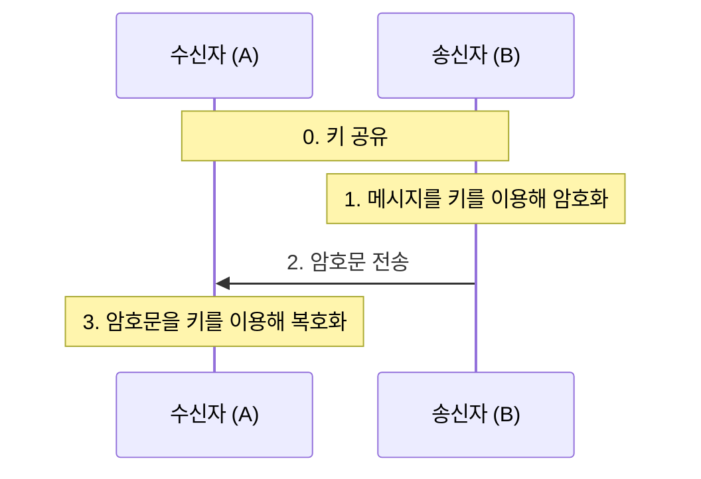
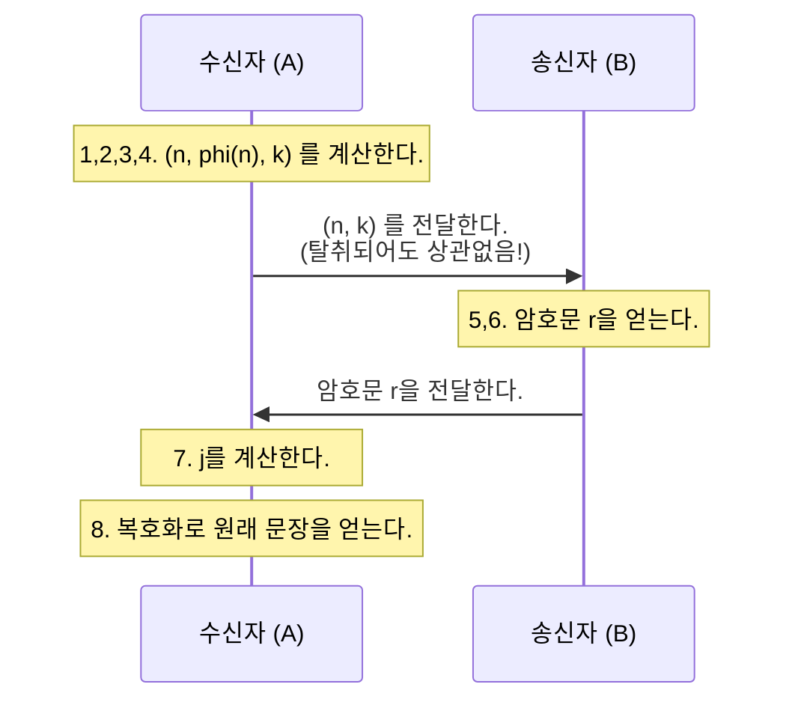

# RSA

## Prerequisites

### Basic concepts of Number theory

#### GCD(greatest common divisor)

!!! info "GCD"
    $$
    \begin{matrix}
    \text{Let} \ d \  \text{be} \gcd(a, b). \\
    d = \min\{ax + by : x,y \in \mathbb{Z}\}
    \end{matrix}
    $$

가장 유명한 성질 중 하나인데, GCD는 $ax + by$ 로 만들 수 있는 가장 작은 수이다

Mathematical Induction으로 증명할 수 있음

#### Linear Congruence

!!! info "Linear Congruence"
    $$
    \begin{matrix}
    ax \equiv b \pmod{n} \ \text{has a solution} \Leftrightarrow d \mid b \ (\text{where} \ d = \gcd(a, n)) \\
    \text{If then, it has} \ d \ \text{incongruent solutions.}
    \end{matrix}
    $$

사실은 위의 GCD 성질에서부터 바로 유도된다

$ax \equiv b \pmod{n}$ 의 해가 존재한다는 것은, $ax + ny = b$ 인 $y$ 가 존재한다는 뜻이고, 어떤 $t$ 에 대해서 $ax + ny = dt = b$ 이다.

이후는 설명할 필요도 없다. 반대도 비슷하다.

(실제 해를 구하는 방법도 간단하니 궁금하면 찾아보세요)

### Fermat's little Theorem

!!! info "Fermat's little Theorem"
    $$
    \begin{matrix}
    \text{Let} \ p \ \text{be a prime and} \ p \nmid a. \\
    a^{p-1} \equiv 1 \pmod{p}.
    \end{matrix}
    $$

이건 설명하기에는 너무 유명하다

여담이지만 little만 소문자로 쓰는 이유는 FLT(Fermat's Last Theorem)가 있기 때문임..

## Preliminaries

### Euler's phi function

!!! note "Euler's phi($\phi$) function"
    $$\phi(n) = \# \ \text{of} \ k < n \ s.t. \ \gcd(k, n) = 1$$

정수론에서 매우 중요한 역할을 하는 $\phi$ 함수이다.

$n$ 보다 작은 서로소의 개수를 나타낸다.

#### Properties

!!! info "Properties"
    $$
    \begin{aligned}
    \textbf{(a)} \ &\text{If} \ p \ \text{is a prime, then} \ \phi(p) = p-1 \\
    \textbf{(b)} \ &\phi \ \text{is multiplicative.} \\
    &\text{i.e.} \ \text{if} \ \gcd(m, n) = 1, \ \text{then} \ \phi(mn) = \phi(m)\phi(n)
    \end{aligned}
    $$

multiplicative 개념은 정수론 전반에 등장하므로, 알아두면 좋다.

### Euler's Theorem

!!! info "Euler's Theorem"
    $$
    \begin{matrix}
    \text{If} \ \gcd(a, n) = 1, \ \text{then} \ a^{\phi(n)} \equiv 1 \pmod{n}
    \end{matrix}
    $$

위에서 서술한 페르마 소정리의 일반화 버전이다.

$n$ 이 소수라면 $a^{\phi(n)} \equiv a^{n-1} \equiv 1 \pmod{n}$ 이 된다.

## RSA

### How does it work?

!!! example "RSA Algorithm"
    1. 두 소수(일반적으로 아주 큰) $p, q$ 를 선택한다.
    2. 두 소수의 곱 $n = pq$ 을 계산한다.
    3. $\phi(n)$ 을 **아주 쉽게** 계산한다.
        - (위에서 언급한 성질을 이용하여 $\phi(n) = \phi(pq) = \phi(p)\phi(q) = (p-1)(q-1)$ 임을 알 수 있다.)

    4. $1 < k < \phi(n)$, $\gcd(k, \phi(n)) = 1$ 인 $k$ 를 아무거나 선택한다.
        - 이러한 $k$ 는 자명히 존재한다.
        - 이 $(n, k)$ 쌍은 **public key**가 된다(!!)

    5. 이제 암호화 하고자 하는 문장(수로 표현된)을 $M$이라 하자.
        - 중요한 점은, 우리는 $\pmod{n}$ 상에서 사용할 것이기 때문에 $M$ 은 $n$ 보다 작아야 한다는 것이다. $M$ 을 $n$ 보다 작아질때까지 자르는 방식 등을 사용할 수 있다. (ex. 123456789 -> 123/456/ 789)

    6. $M^k \equiv r \pmod{n}$ 이라 할때, 암호화된 문장은 $r$ 이 된다.
    7. $1 < j < \phi(n)$ 인 $j$ 중에서, $kj \equiv 1 \pmod{\phi(n)}$ 인 $j$ 를 고른다.
        - [여기](#linear-congruence)에서 서술했듯이, 이러한 $j$ 는 딱 하나, **반드시** 존재한다.
        - (애초에 $\gcd(k, \phi(n)) = 1$ 인 $k$ 를 골랐기 때문)
    
    8. $r^j \equiv (M^k)^j \equiv M^{kj} \pmod{n}$ 이다. 이렇게 되면 어떤 $t$ 에 대해 $M^{kj} \equiv M^{1 + t\phi(n)} \equiv M \cdot M^{\phi(n)} \pmod{n}$ 이다. 오일러 정리에 의해서 $M \cdot M^{\phi(n)} \equiv M \cdot 1 \equiv M \pmod{n}$ 이다. 즉, 암호화한 문장을 알아냈다.
        - **$\gcd(M, n) \neq 1$ 이라면?** 이라는 아주 날카로운 질문을 할 수도 있다. 결론은 **상관없이 제대로 작동한다**지만, 궁금하면 아래를 참고

??? warning "CRT (Chinese Remainder Theorem)"
    나중에씀

이 알고리즘만 봐서는 이 방식이 어떤식으로 작동하는지 이해가 어려울 수 있다.

왜냐하면 이 암호화는 old-fashioned 암호화와 아주 큰 차이점 하나가 있기 때문인데,
그건 바로 이 암호화는 **공개키 암호방식(Public-key cryptography)**이라는 것이다.

그래서 암호화(encoding)하는 사람과 복호화(decoding)하는 사람이 알고있는 정보가 다르고,
이 정보들을 계산하는 과정이 번갈아 가며 나오기 때문이다.

RSA의 동작방식을 잠시 제쳐두고 공개키 암호화에 대해서 잠깐 알아보자

### Public-key cryptography

#### Symmetric-key cryptography

우선 아주 이전부터 사용하던 직관적인 암호화인 대칭키 암호화 (Symmetric-key cryptography)에 대해서 알아보자.

그림만 보고도 알 수 있을 정도로 직관적이고 간단하다.

대표적인 예시로 카이사르 암호화 등이 있다.

다만 이 방식에는 큰 허점이 있는데, **두 사람이 키를 공유하는 과정이 필수적**이라는 것이다.

이는 온라인 상황등에서는 아주 치명적이다.

키를 공유하는 과정이 공개적으로 이루어지기 때문에 탈취가 매우 쉽기 때문이다.

#### Public-key cryptography

그렇다면 공개키 암호화는 어떨까?
어떻게 이 문제를 해결할까?

공캐기 암호화는 비대칭키 암호화라는 방식으로 이 문제를 해결한다.

이 방식에서는 암호화에 사용되는 키와 복호화에 사용되는 키가 다르다.

따라서 암호화에 사용되는 키만 알고 있다면 암호화된 문장을 복호화 할 수가 없다.

즉, 복호화 키는 나 혼자만 가지고 있는 상태로 암호화 키를 모두에게 공개하고,
송신자는 이 암호화 키를 이용해 메시지를 암호화 한 다음 이 암호문 또한 모두에게 공개한다.
그럼 수신자는 이 암호문을 받아, 나만 가지고 있는 복호화 키로 암호문을 해독한다.

이렇게 키를 탈취(?)당할 걱정 없이 메시지를 몰래 주고받을 수 있다.

그럼 이제 다시한번 [이거](#how-does-it-work)를 이해해보자.

#### Is it safe?

이 방식이 과연 안전할까?

암호화 키 만으로 복호화를 할 수는 없을까?

**물론 가능하다.**

모든 공개키 암호화는 이론적으로, 그리고 직관적으로 당연하게도 풀 수 있다.

RSA를 암호화키만으로 푸는 방법은 간단하다.

$(n, k)$ 가 주어졌을 때, $\phi(n)$ 을 구하기만 하면 된다.
그리고 이는 간단히 구할 수 있다. $n$ 보다 작은 수들을 하나씩 서로소인지 판단해 보면 된다.

눈치챘겠지만, 그래서 우리는 1번 과정에서 아주 큰 두 소수를 구할 필요가 있었다.
수신자는 $\phi$ 의 성질을 이용해 아주 쉽게 $\phi(n)$ 을 계산할 수 있었지만, 어떤 두 소수가 곱해졌는지 모르는 송신자에게는 불가능하다.

다만 이 문제가 현재 P-문제에 속하지 않을 것으로 강하게 추측되고 있고, 실용적인 레벨에서 현재 $\phi(n)$ 을 직접 계산하는데에는 우주의 나이보다도 긴 시간이 필요하다고 알려져 있으므로 걱정할 필요는 없을 것으로 추정된다.